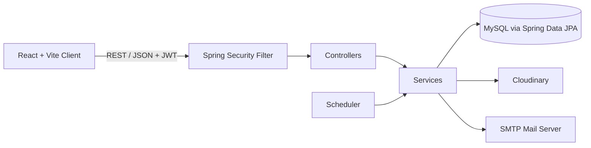

<div align="center">

# 💰 Money Manager System — Backend API

### Secure, scalable REST API for personal finance management

Built with **Spring Boot**, **Spring Security (JWT)**, **Spring Data JPA** and **MySQL**


### 🎬 [▶ Watch the Full Demo Video](YOUR_GOOGLE_DRIVE_VIDEO_LINK)

[Frontend Repo](YOUR_FRONTEND_REPO_LINK) · [Demo Video](YOUR_GOOGLE_DRIVE_VIDEO_LINK) · [Report a Bug](../../issues)

</div>

---

## 📖 About

**Money Manager System** is a full-stack personal finance platform that helps users track income and expenses, understand their spending through analytics, and stay consistent with daily email reminders.

This repository contains the **backend REST API**. It handles authentication, transaction management, media uploads, report generation, and scheduled email notifications.

> 🖥️ The React client lives in a separate repository: **[Money Manager — Frontend](YOUR_FRONTEND_REPO_LINK)**

---

## ✨ Features

| | Feature | Description |
|---|---|---|
| 🔐 | **JWT Authentication** | Stateless register/login with Spring Security and signed JSON Web Tokens |
| 💵 | **Income & Expense Management** | Full CRUD with server-side validation (Bean Validation) |
| 🗂️ | **Categories** | Organize transactions by custom categories with emoji icons |
| 🖼️ | **Profile Pictures** | Image upload and storage through Cloudinary |
| 📊 | **Analytics Endpoints** | Aggregated data powering the dashboard charts |
| 📥 | **Download Transactions** | Export transaction history as an Excel file (`.xlsx`) |
| 📧 | **Email Transactions** | Send the Excel (`.xlsx`) transactions report directly to the user's inbox |
| ⏰ | **Daily Email Reminders** | Scheduled jobs remind users to log their daily spending |
| 🛡️ | **Secure by Default** | Password hashing, protected routes, CORS configuration |

---

## 🏗️ Architecture



**Layered design:** `Controller → Service → Repository → Entity`, with DTOs separating the API contract from the persistence model.

---

## 🧰 Tech Stack

- **Language:** Java 17+
- **Framework:** Spring Boot
- **Security:** Spring Security + JWT
- **Persistence:** Spring Data JPA (Hibernate)
- **Database:** MySQL
- **Media Storage:** Cloudinary
- **Email:** Spring Mail (SMTP)
- **Scheduling:** Spring `@Scheduled`
- **Build Tool:** Maven

---

## 📁 Project Structure

```
src/main/java/com/moneymanager
├── config          # Security, CORS, JWT, Cloudinary & mail configuration
├── controller      # REST controllers
├── dto             # Request / response objects
├── entity          # JPA entities
├── repository      # Spring Data JPA repositories
├── security        # JWT filter & utilities
├── service         # Business logic
└── scheduler       # Daily reminder jobs
```

> Adjust the package names above to match your actual structure.

---

## 🔌 API Overview

> Replace with your real routes if they differ.

### Auth
| Method | Endpoint | Description |
|---|---|---|
| `POST` | `/api/auth/register` | Create a new account |
| `POST` | `/api/auth/login` | Authenticate and receive a JWT |

### Transactions
| Method | Endpoint | Description |
|---|---|---|
| `GET` | `/api/incomes` | List incomes |
| `POST` | `/api/incomes` | Add an income |
| `DELETE` | `/api/incomes/{id}` | Delete an income |
| `GET` | `/api/expenses` | List expenses |
| `POST` | `/api/expenses` | Add an expense |
| `DELETE` | `/api/expenses/{id}` | Delete an expense |

### Dashboard & Reports
| Method | Endpoint | Description |
|---|---|---|
| `GET` | `/api/dashboard` | Totals and chart data |
| `GET` | `/api/reports/download` | Download transactions as Excel (`.xlsx`) |
| `POST` | `/api/reports/email` | Email the Excel report to the user |

Protected routes require the header:

```
Authorization: Bearer <your_jwt_token>
```

---

## 🚀 Getting Started

### Prerequisites

- JDK 17 or newer
- Maven 3.8+
- MySQL 8+
- A [Cloudinary](https://cloudinary.com) account
- An SMTP account (Gmail app password, Brevo, Mailtrap, etc.)

### 1. Clone the repository

```bash
git clone YOUR_BACKEND_REPO_LINK
cd money-manager-backend
```

### 2. Create the database

```sql
CREATE DATABASE money_manager;
```

### 3. Configure environment

Edit `src/main/resources/application.properties` (or use environment variables):

```properties
# Database
spring.datasource.url=jdbc:mysql://localhost:3306/money_manager
spring.datasource.username=YOUR_DB_USER
spring.datasource.password=YOUR_DB_PASSWORD
spring.jpa.hibernate.ddl-auto=update

# JWT
jwt.secret=YOUR_LONG_RANDOM_SECRET
jwt.expiration=86400000

# Cloudinary
cloudinary.cloud-name=YOUR_CLOUD_NAME
cloudinary.api-key=YOUR_API_KEY
cloudinary.api-secret=YOUR_API_SECRET

# Mail
spring.mail.host=smtp.gmail.com
spring.mail.port=587
spring.mail.username=YOUR_EMAIL
spring.mail.password=YOUR_APP_PASSWORD
spring.mail.properties.mail.smtp.auth=true
spring.mail.properties.mail.smtp.starttls.enable=true
```

> ⚠️ Never commit real secrets. Use environment variables or a git-ignored properties file.

### 4. Run the application

```bash
mvn spring-boot:run
```

The API will be available at **http://localhost:8080**

---

## 🔒 Security Notes

- Passwords are hashed with BCrypt
- Stateless sessions using signed JWTs
- Protected endpoints enforced via a custom JWT authentication filter
- Input validation on all write operations
- CORS restricted to the frontend origin

---

## 🗺️ Roadmap

- [ ] Budget limits and overspending alerts
- [ ] Recurring transactions
- [ ] Multi-currency support
- [ ] Docker & Docker Compose setup
- [ ] Swagger / OpenAPI documentation
- [ ] Unit and integration tests

---

## 🤝 Contributing

Contributions, issues, and feature requests are welcome. Feel free to open an issue or submit a pull request.

---

## 👨‍💻 Author

**Momen Tarek Nagaty**

[](https://www.linkedin.com/in/momen-tarek-nagaty)
[](https://github.com/momen-tarek111)
[](mailto:momen.tarek.nagaty@gmail.com)

---

<div align="center">

⭐ If you found this project useful, please consider giving it a star!

</div>