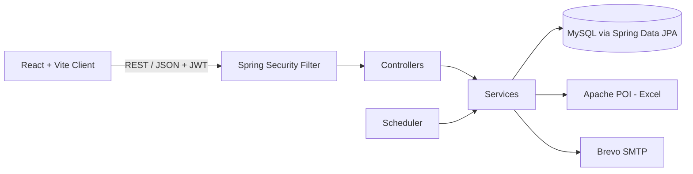

<div align="center">

# 💰 Money Manager System — Backend API

### Secure, scalable REST API for personal finance management

Built with **Spring Boot 4**, **Spring Security (JWT)**, **Spring Data JPA** and **MySQL**


### 🎬 [▶ Watch the Full Demo Video](https://drive.google.com/file/d/1olxFyz-vF0IOY_kU3CUsPkTuShyTrhNa/view?usp=sharing)

[Frontend Repo](https://github.com/momen-tarek111/Money-Manager-App.git) · [Demo Video](https://drive.google.com/file/d/1olxFyz-vF0IOY_kU3CUsPkTuShyTrhNa/view?usp=sharing) · [Report a Bug](../../issues)

</div>

---

## 📖 About

**Money Manager System** is a full-stack personal finance platform that helps users track income and expenses, understand their spending through analytics, and stay consistent with daily email reminders.

This repository contains the **backend REST API**. It handles authentication, transaction management, Excel report generation, and scheduled email notifications.

> 🖥️ The React client lives in a separate repository: **[Money Manager — Frontend](https://github.com/momen-tarek111/Money-Manager-App.git)**

---

## ✨ Features

| | Feature | Description |
|---|---|---|
| 🔐 | **JWT Authentication** | Stateless register/login with Spring Security and signed JSON Web Tokens |
| ✉️ | **Email Account Activation** | New accounts are activated through a link sent by email |
| 💵 | **Income & Expense Management** | Full CRUD with server-side validation (Bean Validation) |
| 🗂️ | **Categories** | Organize transactions by custom categories with emoji icons |
| 🖼️ | **Profile Pictures** | Stores each user's avatar (uploaded to Cloudinary from the React client) |
| 📊 | **Analytics Endpoints** | Aggregated data powering the dashboard charts |
| 📥 | **Download Transactions** | Export incomes and expenses as Excel files (`.xlsx`) using Apache POI |
| 📧 | **Email Transactions** | Send the Excel (`.xlsx`) report directly to the user's inbox via Brevo SMTP |
| ⏰ | **Daily Email Reminders** | Scheduled jobs remind users to log their daily spending |
| 🛡️ | **Secure by Default** | BCrypt password hashing, protected routes, CORS configuration |

---

## 🏗️ Architecture



**Layered design:** `Controller → Service → Repository → Entity`, with DTOs separating the API contract from the persistence model.

---

## 🧰 Tech Stack

| Category | Technology | Version |
|---|---|---|
| Language | Java | 21 |
| Framework | Spring Boot (Web MVC) | 4.1.1 |
| Security | Spring Security | managed by Spring Boot |
| JWT | JJWT (`jjwt-api`, `jjwt-impl`, `jjwt-jackson`) | 0.11.5 |
| Persistence | Spring Data JPA (Hibernate) | managed by Spring Boot |
| Database | MySQL + MySQL Connector/J | 8.x |
| Excel Export | Apache POI (`poi-ooxml`) | 5.2.5 |
| Email | Spring Mail + Brevo SMTP | managed by Spring Boot |
| Boilerplate | Lombok | managed by Spring Boot |
| Build Tool | Maven | 3.9+ |

---

## 📁 Project Structure

```
src/main/java/in/momentarek/moneymanager
├── config          # Security, CORS & application configuration
├── controller      # REST controllers
├── dto             # Request / response objects
├── entity          # JPA entities
├── repository      # Spring Data JPA repositories
├── security        # JWT filter & security utilities
├── service         # Business logic
└── util            # Generate and verify JWT tokens
```

---

## 🔌 API Overview

**Base URL:** `http://localhost:8080/api/v1.0`

> Every endpoint below is relative to the base URL (context path `/api/v1.0`).

### Auth
| Method | Endpoint | Description |
|---|---|---|
| `POST` | `/register` | Create a new account |
| `POST` | `/login` | Authenticate and receive a JWT |

### Transactions
| Method | Endpoint | Description |
|---|---|---|
| `GET` | `/incomes` | List incomes |
| `POST` | `/incomes` | Add an income |
| `DELETE` | `/incomes/{id}` | Delete an income |
| `GET` | `/expenses` | List expenses |
| `POST` | `/expenses` | Add an expense |
| `DELETE` | `/expenses/{id}` | Delete an expense |

### Dashboard & Reports
| Method | Endpoint | Description |
|---|---|---|
| `GET` | `/dashboard` | Totals and chart data |
| `GET` | `/excel/download/income` | Download incomes as Excel (`.xlsx`) |
| `GET` | `/excel/download/expense` | Download expenses as Excel (`.xlsx`) |
| `GET` | `/email/income-excel` | Email the Excel income report to the user |
| `GET` | `/email/expense-excel` | Email the Excel expense report to the user |

Protected routes require the header:

```
Authorization: Bearer <your_jwt_token>
```

---

## 🚀 Getting Started

### Prerequisites

- JDK 21
- Maven 3.9+
- MySQL 8+
- A [Brevo](https://www.brevo.com) account (free SMTP relay) for emails

### 1. Clone the repository

```bash
git clone https://github.com/momen-tarek111/Money-Manager-App.git
cd Money_Manager_Server
```

### 2. Create the database

```sql
CREATE DATABASE moneymanager;
```

### 3. Configure environment variables

The app reads everything from environment variables and falls back to local defaults where it makes sense (`src/main/resources/application.properties`):

```properties
# 1. Database (cloud URL if provided, otherwise local MySQL)
spring.datasource.url=${SPRING_DATASOURCE_URL:jdbc:mysql://localhost:3306/moneymanager}
spring.datasource.username=${SPRING_DATASOURCE_USERNAME:root}
spring.datasource.password=${SPRING_DATASOURCE_PASSWORD}

# 2. Server port & context path (hosting platforms pass $PORT dynamically)
server.port=${PORT:8080}
server.servlet.context-path=/api/v1.0

# 3. JPA / Hibernate (use 'validate' or 'none' in production)
spring.jpa.hibernate.ddl-auto=update
spring.jpa.show-sql=false
spring.jpa.properties.hibernate.format_sql=false

# 4. Email (Brevo SMTP)
spring.mail.host=smtp-relay.brevo.com
spring.mail.port=587
spring.mail.username=${BREVO_USERNAME}
spring.mail.password=${BREVO_PASSWORD}
spring.mail.properties.mail.smtp.auth=true
spring.mail.properties.mail.smtp.starttls.enable=true
spring.mail.protocol=smtp
spring.mail.properties.mail.smtp.from=${BREVO_FROM_EMAIL}

# 5. Security & JWT
jwt.secret=${JWT_SECRET}
jwt.expiration=86400000

# 6. Frontend & backend URLs
money.manager.frontend.url=${MONEY_MANAGER_FRONTEND_URL:http://localhost:3000}
app.activation.url=${MONEY_MANAGER_BACKEND_URL:http://localhost:8080}
```

| Variable | Required | Description |
|---|---|---|
| `SPRING_DATASOURCE_URL` | Optional | JDBC URL (defaults to local MySQL) |
| `SPRING_DATASOURCE_USERNAME` | Optional | Database user (default `root`) |
| `SPRING_DATASOURCE_PASSWORD` | ✅ | Database password |
| `PORT` | Optional | Server port (default `8080`) |
| `BREVO_USERNAME` | ✅ | Brevo SMTP login |
| `BREVO_PASSWORD` | ✅ | Brevo SMTP key |
| `BREVO_FROM_EMAIL` | ✅ | Verified sender address |
| `JWT_SECRET` | ✅ | Long random secret used to sign tokens |
| `MONEY_MANAGER_FRONTEND_URL` | Optional | Frontend origin (CORS and email links) |
| `MONEY_MANAGER_BACKEND_URL` | Optional | Public backend URL used in activation links |

> ⚠️ Never commit real passwords or secrets. Keep them in environment variables and generate a fresh `JWT_SECRET` for every environment.

### 4. Run the application

```bash
mvn spring-boot:run
```

The API will be available at **http://localhost:8080/api/v1.0**

### 5. Build for production

```bash
mvn clean package
java -jar target/moneymanager-0.0.1-SNAPSHOT.jar
```

---

## ☁️ Deployment

The configuration is cloud-ready: the port comes from `$PORT`, and the database, mail and JWT settings come from environment variables, so it deploys easily to platforms such as **Render**, **Railway** or any Docker host. Set `ddl-auto` to `validate` or `none` in production.

---

## 🔒 Security Notes

- Passwords are hashed with BCrypt
- Stateless sessions using signed JWTs
- Protected endpoints enforced via a custom JWT authentication filter
- Input validation on all write operations
- CORS restricted to the frontend origin
- All secrets are supplied through environment variables

---

## 🗺️ Roadmap

- [ ] Budget limits and overspending alerts
- [ ] Recurring transactions
- [ ] Multi-currency support
- [ ] Docker & Docker Compose setup
- [ ] Swagger / OpenAPI documentation
- [ ] Unit and integration tests

---

## 🤝 Contributing

Contributions, issues, and feature requests are welcome. Feel free to open an issue or submit a pull request.

---

## 👨‍💻 Author

**Momen Tarek Nagaty**

[](https://www.linkedin.com/in/momen-tarek-nagaty)
[](https://github.com/momen-tarek111)
[](mailto:momen.tarek.nagaty@gmail.com)

---

<div align="center">

⭐ If you found this project useful, please consider giving it a star!

</div>